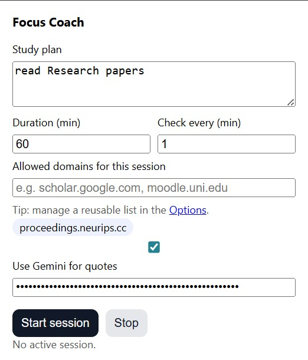

# 🧠 Focus Coach (Focus SOS)

**Focus Coach** is a Chrome Extension (Manifest V3) that enforces deep work sessions. It actively monitors your browsing habits and uses **Google Gemini AI** to intervene when you get distracted.

Unlike simple timers, Focus Coach is **context-aware**. If you drift off while studying "Quantum Physics," the AI knows exactly what you should be doing and generates a specific, witty, or strict motivation to get you back on track.



## ✨ Key Features

* **🛡️ Active Distraction Shield:**
    * Checks your active tab every X minutes (configurable).
    * If you visit a non-allowed site (e.g., social media), the extension **injects a full-screen overlay** into the page, blocking the content.
* **🤖 Context-Aware AI Coaching:**
    * Uses **Google Gemini 1.5 Flash** to generate dynamic quotes.
    * **How it works:** It sends your current task (e.g., "Finish Math Homework") to the AI. The AI responds with a personalized nudge (e.g., *"Algebra won't solve itself, close Instagram."*).
* **⏱️ Smart Session Management:**
    * Set custom duration and check intervals (e.g., check every 1 minute for strict mode).
    * "Back to Work" button automatically redirects you to your allowed study resources.
* **🔒 Privacy & Security:**
    * **Bring Your Own Key:** Your Gemini API Key is stored safely in `chrome.storage.local`.
    * **Local Processing:** URL checking happens entirely on your device. Browsing history is never sent to any server.

## 🚀 Installation (Developer Mode)

1.  **Clone the repository:**
    ```bash
    git clone [https://github.com/YOUR_USERNAME/focus-sos.git](https://github.com/YOUR_USERNAME/focus-sos.git)
    ```
2.  **Open Chrome Extensions:**
    * Go to `chrome://extensions`.
    * Toggle **Developer mode** (top right corner).
3.  **Load the Extension:**
    * Click **Load unpacked**.
    * Select the folder containing this project's files.

## ⚙️ Configuration

1.  Click the **Focus Coach** icon.
2.  **Setup:**
    * **Study Plan:** Type what you are working on (important for the AI context).
    * **Allowed Domains:** Add the sites you need (e.g., `github.com, stackoverflow.com`).
    * **Gemini API Key:** Paste your key to enable the AI features.
3.  **Start Session:** The extension will now monitor your tabs in the background.

## 🛠️ Technical Details

* **Manifest V3:** Uses a persistent Service Worker (`background.js`) for alarm management.
* **Content Injection:** Uses `chrome.scripting` / content scripts to modify the DOM of distracting websites in real-time.
* **Storage:** `chrome.storage.local` for persisting session state and API keys.

## 📄 License

MIT License